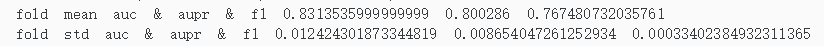
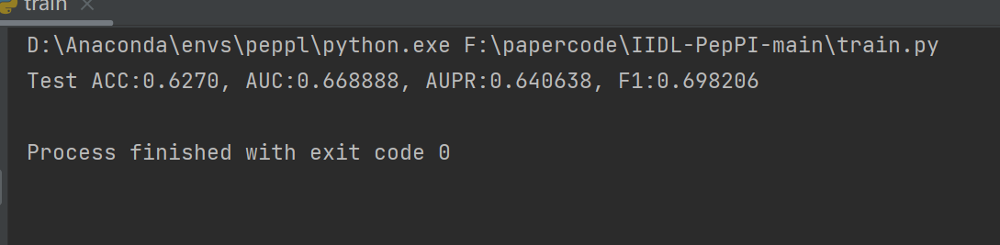

数据源：
RCSB PDB database,每年会更新
UniProt database

PSI-BLAST (Position-Specific Iterated BLAST) 是一种用于蛋白质序列比对的工具，它可以用来搜索蛋白质数据库以找到相似的序列。
与传统的BLAST相比，PSI-BLAST通过迭代的方式构建位置特异性评分矩阵（PSSM），
从而提高对远亲同源序列的检测能力。在蛋白质结构预测、功能注释等方面有着广泛的应用。

IUPredA
IUPredA 是一个用于预测无序区域的工具，它可以用来识别蛋白质序列中无固定三维结构的部分。
IUPredA通过分析氨基酸组成和局部序列环境来预测无序倾向，这对于理解蛋白质的功能和相互作用具有重要意义。

SCRATCH
SCRATCH (Self-consistent refinement by an automated combination of homology and threading) 是一个综合性的蛋白质结构预测服务器，
它能够预测蛋白质的二级结构、三级结构、接触图谱等。
SCRATCH 使用了一系列先进的算法和技术，包括基于模板的建模、从头预测等，适用于多种类型的蛋白质结构预测任务。

ProBERT
ProBERT 是一个基于Transformer架构的预训练模型，专门设计用于蛋白质序列的表示学习。
ProBERT 通过对大量的蛋白质序列进行预训练，可以捕获蛋白质序列中的复杂关系和模式，进而用于下游任务，如蛋白质功能预测、结构预测等。
ProBERT 的核心思想是利用深度学习技术从蛋白质序列中自动学习有意义的特征表示。

x_p,x_2_p,x_ss_p,x_dense_p,x_bert_p分别对应：序列硬编码，Physical and chemical properties，无序性，二级结构特征，预训练嵌入。
去掉了预训练嵌入、PSSM、无序性、二级结构
五折交叉验证

iupRED2A工具需要熟悉

关于语境的理解;
     类似于自然语言中每个句子的含义虽然会因为语境（上下文）和语气的不同发生变化，蛋白质语言也会因为其生物环境（无序结构，理化性质等）和与不同分子的相互作用
     （与不同肽交互可视为蛋白序列的语境，通过双向注意，可以很好的建模这样一个语境，从而更好表征序列特征）
     ,蛋白质的行为方式可能发生变化(形成同一复合物时，残基结合位点有差异)
代码复现;
    
    五种特征，其中无序性特征、二级结构特征没用；对于预训练嵌入，先单独获得，再加载，否则爆显存，
    
大模型结合语用分析。

把之前任务结合这篇文章讲一下，有什么共通点和不同，有没有能结合的点；
    相同点
    目标相似性：
        两种任务都需要从数据中提取实体（肽/蛋白质 或 实体/概念）及其相互之间的关系。
        在两个任务中，模型都需要识别哪些实体之间存在特定类型的交互或者关联。
    数据结构：
        都可以被看作是一个分类问题，其中模型需要判断一个给定的关系是否存在。
        都可能使用到特征工程、深度学习等技术来建模。
    和知识图谱的结合，是否可以重建为链接预测任务？
    肽-蛋白对之间是否存在信息的交互？
    是否可以对序列进行“句法分析”？

对于生物信息学相关知识点整理分类。

框架，数据以及思考下，现有的自然语言处理大模型和T5之间的关系，多组学大模型能不能也用T5框架完成，生物数据大模型

